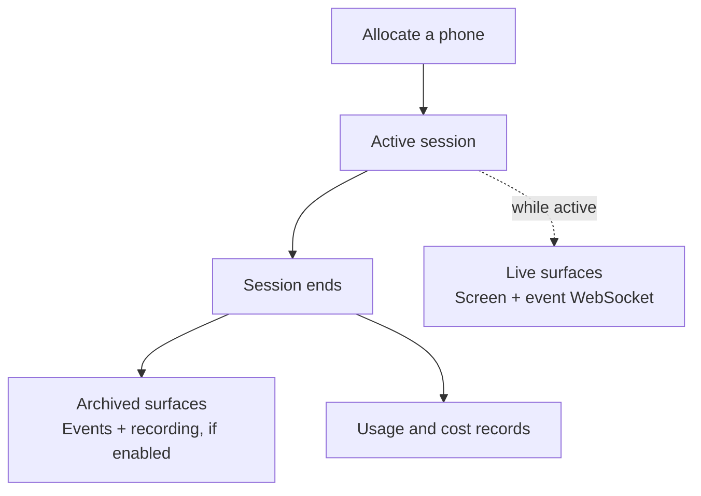

Axilio gives you different views of a phone session at different points in its
lifecycle. Watch the screen and follow events while the session is active. After
it ends, inspect the archived event timeline, retrieve an available recording,
and review the associated usage.

## Follow a session from start to finish

<Note>
  The live screen, live event stream, archived events, recording, and billing
  records are separate surfaces. They have different formats, availability, and
  retention behavior.
</Note>

## While a session is active

<CardGroup cols={2}>
  <Card title="Watch the live screen" icon="tower-broadcast" href="/observability/live-view">
    Open the session in the dashboard or use its hosted live-view URL.
  </Card>
  <Card title="Embed the live view" icon="window" href="/observability/embed-live-view">
    Put the interactive phone screen inside your own application.
  </Card>
  <Card title="Stream live session events" icon="wave-pulse" href="/observability/live-session-events">
    Follow driver calls, inference activity, and output logs over WebSocket.
  </Card>
  <Card title="Find a session" icon="magnifying-glass" href="/observability/sessions">
    Search active and historical sessions, then open one for investigation.
  </Card>
</CardGroup>

## After a session ends

<CardGroup cols={2}>
  <Card title="Inspect session events" icon="list-check" href="/observability/session-events">
    Query the archived event timeline through the REST API or SDK.
  </Card>
  <Card title="Retrieve a recording" icon="video" href="/observability/recordings">
    Check processing status and obtain a short-lived playback URL.
  </Card>
  <Card title="Review usage and cost" icon="coins" href="/billing/usage-and-cost">
    Analyze billed inference calls and aggregate usage over time.
  </Card>
  <Card title="Understand data lifecycle" icon="shield-halved" href="/observability/data-lifecycle">
    See which surfaces are live, persisted, processed, retained, or separately billed.
  </Card>
</CardGroup>

## Compare the surfaces

| Surface | Available | Interface | What it contains |
| --- | --- | --- | --- |
| Sessions | Active and historical | Dashboard, REST, SDK | Session status, source, phone, workflow, and recording state |
| Live view | While active | Dashboard or signed URL | The interactive phone screen |
| Live session events | While active, with bounded recent replay | Axilio WebSocket | Span lifecycle frames and logs |
| Archived session events | After ingestion | REST and SDK | A paginated Axilio event projection |
| Recording | When enabled and ready | Dashboard, REST, SDK | The recorded phone screen |
| Usage and cost | Billing lifecycle | Usage API | Authoritative usage and charges |

## Sessions and runs

A **session** is the period during which one phone is allocated. A **run** is a
workflow execution that may happen inside that session. Interactive sessions do
not have a workflow run.

Use `session_id` with the session, event, and recording APIs. Use
`run_id` when checking or controlling a workflow run. If you start from a run,
read its `session_id` before querying session observability data.

## Handle live URLs safely

<Warning>
  `live_view_url` and `telemetry_url` contain credentials scoped to one session.
  Do not log them, send them to analytics, or expose them to an untrusted client.
  Deallocating the session prevents new connections; your application should
  also close any viewer or WebSocket it already opened.
</Warning>

## OpenTelemetry and the customer interfaces

Axilio uses OpenTelemetry-derived trace and log data internally. The customer
interfaces documented here are Axilio APIs and event formats, not customer OTLP
export endpoints.
