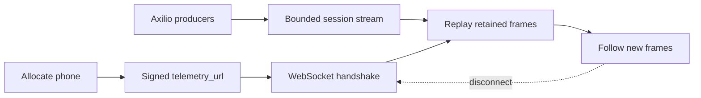
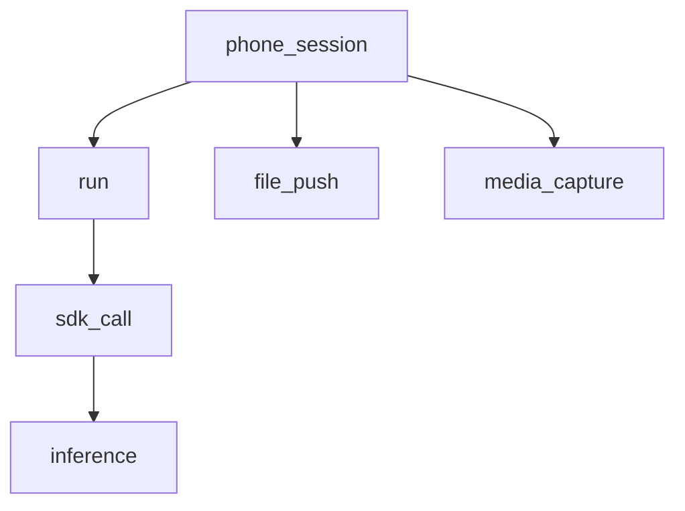
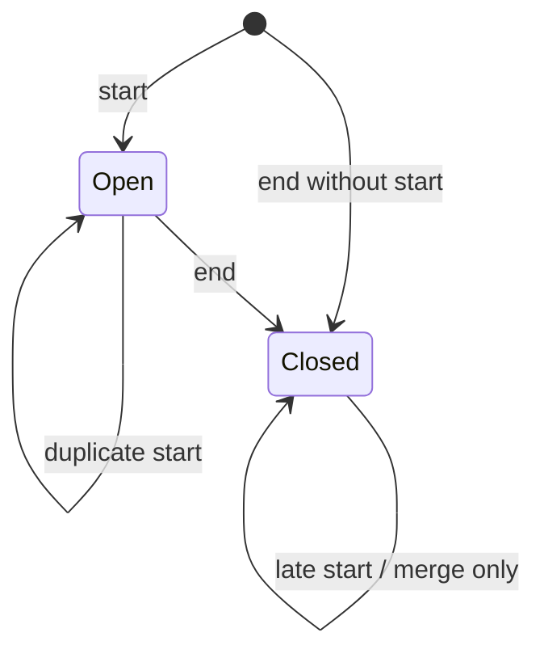

The live session events protocol is a read-only JSON stream for rendering an
active phone session. It carries operations as they start and finish, along
with logs that occur between them.

This protocol is specific to Axilio. It is not OTLP, and it is not the response
schema returned by the [archived session events API](/observability/session-events).

<Warning>
  This protocol is in preview. It has no version field and is not yet a stable
  integration contract. Accept unknown fields and message variants. Do not use
  the stream as an audit log, billing source, or automation trigger.
</Warning>

## Protocol summary

| Property | Behavior |
| --- | --- |
| Transport | WebSocket over TLS (`wss`) |
| Authentication | The signed `telemetry_url` returned by phone allocation |
| WebSocket subprotocol | None |
| Direction | Server to client; application messages sent by the client are ignored |
| Framing | One UTF-8 JSON object in each WebSocket text message |
| Native message variants | Span lifecycle frame or log frame |
| Compatibility variant | Legacy event object |
| Replay | A new connection receives the retained recent window before new messages |
| Acknowledgements | None |
| Resume cursor | None |
| Delivery | Best effort; gaps and duplicates are possible |

Use `telemetry_url` exactly as Axilio returns it. Do not reconstruct its query
parameters or add an API-key header to the WebSocket handshake.



The server sends standard WebSocket ping control frames while the connection
is idle. Most WebSocket libraries respond with pong frames automatically.

## Classify a message

Native frames do not have a shared outer envelope. Classify the parsed object
by its discriminator fields, in this order:

1. A non-empty `log_type` identifies a log frame.
2. A non-empty `span_type` plus `phase` identifies a span lifecycle frame.
3. A non-empty `type` identifies a legacy compatibility event.
4. Anything else is an unknown future variant.

```javascript
function classify(frame) {
  if (typeof frame?.log_type === "string" && frame.log_type) return "log";

  if (
    typeof frame?.span_type === "string" &&
    (frame.phase === "start" || frame.phase === "end")
  ) {
    return "span";
  }

  if (typeof frame?.type === "string" && frame.type) return "legacy";
  return "unknown";
}
```

Ignore any message you cannot classify. Do not reject the stream because one
message contains an unknown field or variant.

## Span lifecycle frames

A span lifecycle frame reports one phase of an operation. A `start` frame lets
you render an operation immediately. An `end` frame settles the same operation
with its end time and status.

Associate the two phases by the pair `trace_id` and `span_id`.

### Start frame

```json
{
  "span_type": "sdk_call",
  "phase": "start",
  "trace_id": "0190b3c78f6e7a1b9c2d3e4f5a6b7c8d",
  "span_id": "018f9a2b1c3d7e4f",
  "parent_span_id": "018f9a2b1c3d7e40",
  "name": "Touch.tap",
  "start_unix_nano": 1787072400123456789,
  "attributes": {
    "axilio.span.type": "sdk_call",
    "axilio.session.id": "0190b3c7-8f6e-7a1b-9c2d-3e4f5a6b7c8d",
    "axilio.run.id": "run_123",
    "axilio.sdk.op": "Touch.tap"
  }
}
```

### Matching end frame

```json
{
  "span_type": "sdk_call",
  "phase": "end",
  "trace_id": "0190b3c78f6e7a1b9c2d3e4f5a6b7c8d",
  "span_id": "018f9a2b1c3d7e4f",
  "parent_span_id": "018f9a2b1c3d7e40",
  "name": "Touch.tap",
  "start_unix_nano": 1787072400123456789,
  "end_unix_nano": 1787072400345678901,
  "attributes": {
    "axilio.span.type": "sdk_call",
    "axilio.session.id": "0190b3c7-8f6e-7a1b-9c2d-3e4f5a6b7c8d",
    "axilio.run.id": "run_123",
    "axilio.sdk.op": "Touch.tap",
    "axilio.ok": true,
    "axilio.duration_ns": 222222112
  },
  "status_code": "Ok"
}
```

### Span field reference

| Field | Type | Present | Meaning |
| --- | --- | --- | --- |
| `span_type` | string | Always | Axilio operation type. Treat unknown values as generic spans. |
| `phase` | `start` or `end` | Always | The lifecycle phase represented by this frame. |
| `trace_id` | string | Always | A 128-bit trace identifier encoded as 32 lowercase hexadecimal characters. One phone session normally maps to one trace. |
| `span_id` | string | Always | A 64-bit operation identifier encoded as 16 lowercase hexadecimal characters. |
| `parent_span_id` | string | Optional | The 16-character span ID of the parent operation. Its absence means the parent is implicit, unavailable, or this is a root. |
| `name` | string | Always | Display name for the operation. |
| `start_unix_nano` | integer | Always | Start time as Unix epoch nanoseconds. |
| `end_unix_nano` | integer | End frames only; can be absent | End time as Unix epoch nanoseconds. |
| `attributes` | object | Optional | Additive Axilio metadata. Keys and values can grow over time. |
| `status_code` | string | Normally on end frames | Current values are `Unset`, `Ok`, and `Error`. Accept unknown values. |
| `status_message` | string | Optional on failed end frames | A human-readable error description. It can contain sensitive customer or runtime data. |

Do not assume that an end frame repeats every attribute from its start frame.
Merge the attribute objects when you reconcile the phases.

<Note>
  Unix nanosecond values exceed JavaScript's safe-integer range. Convert them
  to milliseconds for display, or use a lossless JSON parser when exact
  nanosecond values matter. Python integers and typed Go decoding can retain
  the integer.
</Note>

## Span types and relationships

The current native span taxonomy is additive. New span types can appear without
a protocol version change.



| `span_type` | Represents | Typical parent |
| --- | --- | --- |
| `phone_session` | The lifetime of the allocated phone session | None |
| `run` | A workflow run or interactive editor cell | `phone_session` |
| `sdk_call` | One phone-driver operation | `run`, or the session in local mode |
| `inference` | One model inference triggered by a driver operation | `sdk_call` |
| `file_push` | Delivery of a customer file to the phone | Session-level |
| `media_capture` | A media file detected and retrieved from the phone | Session-level |

Parent identifiers can be absent during compatibility transitions. Use
`parent_span_id` when present, but keep orphan spans visible instead of dropping
them.

## Log frames

A log frame represents a point-in-time event rather than an operation with a
start and end. Logs can correlate to a span, but `span_id` is optional.

```json
{
  "log_type": "output_log",
  "trace_id": "0190b3c78f6e7a1b9c2d3e4f5a6b7c8d",
  "time_unix_nano": 1787072400234567890,
  "severity_text": "INFO",
  "body": "Saved screenshot.png",
  "attributes": {
    "axilio.run.id": "run_123",
    "axilio.log.stream": "stdout"
  }
}
```

### Log field reference

| Field | Type | Present | Meaning |
| --- | --- | --- | --- |
| `log_type` | string | Always | Axilio log category. Treat unknown values as generic logs. |
| `trace_id` | string | Always | The 32-character trace ID for the phone session. |
| `span_id` | string | Optional | The 16-character span ID this log correlates with. |
| `time_unix_nano` | integer | Always | Event time as Unix epoch nanoseconds. |
| `severity_text` | string | Always | Current values are `INFO` and `ERROR`. Accept unknown values. |
| `body` | string | Always | Display text. It can be empty or contain sensitive customer output. |
| `attributes` | object | Optional | Type-specific correlation and detail fields. |

### Current log types

| `log_type` | Represents | Typical detail |
| --- | --- | --- |
| `output_log` | A stdout, stderr, or result line from a run | `body` contains the line; `axilio.log.stream` identifies the channel |
| `output_error` | A run or orchestration error | `body` contains the message; `axilio.error.class` can identify the exception class |
| `kernel_status` | A kernel lifecycle transition | `body` contains a state such as `busy` or `idle` |
| `transfer_progress` | Progress for a file push or media capture | Transfer byte counts are in attributes; `span_id` can identify the related file operation |

`transfer_progress` is a live update. The corresponding file record, rather
than this frame, is the durable source of transfer progress.

## Attribute reference

Attributes are additive metadata. Every field is optional from a consumer's
perspective. A producer can omit an attribute when it does not know the value,
and start and end frames can carry different subsets.

### Correlation and outcome

| Attribute | Value | Meaning |
| --- | --- | --- |
| `axilio.span.type` | string | The span taxonomy value, normally matching `span_type`. |
| `axilio.session.id` | string | Phone session ID. Do not require it; the signed URL already scopes the stream. |
| `axilio.phone.id` | string | Phone business ID. |
| `axilio.org.id` | string | Owning organization ID. |
| `axilio.user.id` | string | User associated with the operation. |
| `axilio.workflow.id` | string | Workflow associated with the operation. |
| `axilio.run.id` | string | Workflow run or interactive cell ID. |
| `axilio.session.source` | string | Current values include `workflow` and `interactive`. |
| `axilio.duration_ns` | integer | Source-measured duration in nanoseconds. Prefer this over subtracting clocks across services. |
| `axilio.ok` | boolean | Whether an outcome-bearing operation succeeded. |
| `axilio.error.code` | string | Machine-readable failure category. |

### Driver and inference detail

| Attribute | Value | Meaning |
| --- | --- | --- |
| `axilio.sdk.op` | string | Driver operation, such as `Touch.tap`. |
| `axilio.ocr.engine` | string | OCR engine selected for an applicable operation. |
| `axilio.model` | string | Model that served an applicable inference. |
| `axilio.model_cost_microdollars` | integer | Producer-reported model cost detail. Use the Usage API as the billing authority. |
| `axilio.inference.id` | string | Inference record ID used to correlate with usage data. |
| `axilio.inference.stages` | string | JSON-encoded stage timing array. Parse this value separately only when needed. |

### File and log detail

| Attribute | Value | Meaning |
| --- | --- | --- |
| `axilio.file.id` | string | File or download record ID. |
| `axilio.file.name` | string | File name. Treat it as potentially sensitive. |
| `axilio.file.mime_type` | string | File MIME type. |
| `axilio.file.size_bytes` | integer | Total file size. |
| `axilio.file.collection` | string | Destination collection for a file push. |
| `axilio.capture.state` | string | Current media-capture state. |
| `axilio.log.stream` | string | Current output channels include `stdout`, `stderr`, and `result`. |
| `axilio.error.class` | string | Runtime exception class. |
| `axilio.transfer.direction` | string | Current values are `push` and `capture`. |
| `axilio.transfer.bytes` | integer | Bytes transferred so far. |
| `axilio.transfer.size_bytes` | integer | Expected total transfer size. |

Do not branch on the presence of an attribute that the top-level discriminator
already provides. For example, use `span_type`, not `attributes["axilio.span.type"]`,
to classify a frame.

## Reconcile span state

Do not model the stream as a strict sequence of start-then-end pairs. A start
can be missing, an end can arrive first, and reconnecting can replay either
phase.



For each span:

1. Key state by `trace_id` and `span_id`.
2. Create a record from either phase.
3. Merge fields and attributes rather than replacing the record.
4. Mark the record complete when any `end` frame arrives.
5. Never change a completed record back to open because of a later `start`.
6. Use end-phase status and end time when available.
7. Keep a span visible when its parent is missing.

Log frames have no unique message ID. If your UI must suppress replayed logs,
use a best-effort fingerprint of `trace_id`, `span_id`, `time_unix_nano`,
`log_type`, and `body`. Do not treat that fingerprint as a durable identity.

## Ordering, replay, and reconnects

One connection receives messages in the order they were appended to the
session stream. That order is not a causal guarantee across independent
producers.

The stream does not expose its internal cursor. A reconnect starts a new read
from the beginning of the retained window, so it can deliver messages your
client already processed. Frames can also disappear from the window before a
slow or disconnected client reads them.

At the implementation revision documented here, the stream is approximately
capped at 2,000 entries and expires 10 minutes after its latest write. These
are operational values, not a retention promise or service-level guarantee.

Use exponential backoff with jitter when reconnecting. Stop reconnecting when
your application knows the phone session has ended.

<Note>
  Deallocation prevents a new signed-URL connection. It does not currently
  guarantee immediate revocation of a WebSocket that is already connected.
  Close the socket when your application releases the phone.
</Note>

## Legacy compatibility events

During a producer rollout, the stream can also contain the previous event
envelope:

```json
{
  "type": "OUTPUT_LOG",
  "session_id": "0190b3c7-8f6e-7a1b-9c2d-3e4f5a6b7c8d",
  "timestamp": "2026-08-19T14:20:00.123456Z",
  "body": {
    "run_id": "run_123",
    "stream": "stdout",
    "line": "Saved screenshot.png"
  }
}
```

| Field | Type | Meaning |
| --- | --- | --- |
| `type` | string | Legacy event discriminator. |
| `session_id` | string | Phone session ID. |
| `timestamp` | RFC 3339 string | Producer wall-clock time. |
| `body` | any JSON value | Event-specific compatibility payload. Treat it as opaque. |

Common legacy discriminators include `WORKFLOW_RUN_STARTED`,
`WORKFLOW_RUN_FINISHED`, `WORKFLOW_RUN_FAILED`, `SDK_CALL_STARTED`,
`SDK_CALL_COMPLETED`, `OUTPUT_LOG`, `OUTPUT_ERROR`, `KERNEL_STATUS`,
`INFERENCE_STARTED`, `INFERENCE_COMPLETED`, `PHONE_SESSION_STARTED`,
`PHONE_SESSION_ENDED`, `FILE_PUSH_STARTED`, `FILE_PUSH_COMPLETED`,
`MEDIA_CAPTURE_DETECTED`, `MEDIA_CAPTURE_COMPLETED`, and
`TRANSFER_PROGRESS`.

Do not build new behavior around a legacy body's shape. Render the object
generically or ignore event types you do not recognize. This envelope can
disappear after the compatibility rollout ends.

## Relationship to OpenTelemetry

The live protocol borrows trace and span concepts from OpenTelemetry, but its
wire format is intentionally different.

OpenTelemetry exporters normally export a span after it ends. Axilio needs to
show an operation while it is still running, so the live protocol sends a
`start` frame and later reconciles it with an `end` frame. A start frame is not
a completed OpenTelemetry span and cannot be sent to an OTLP receiver.

The archived session events API uses a separate ingestion and projection path.
Do not assume that every live message has an archived equivalent, that every
archived event appeared live, or that the two JSON objects are byte-identical.

## Security considerations

`telemetry_url` is a session-scoped bearer credential. Anyone who obtains the
full URL can read the stream while that access remains valid.

- Do not log, persist, or send the URL to analytics and error-reporting tools.
- Redact query strings from proxy and application logs.
- Pass the URL only to the component that consumes the stream.
- Treat log bodies, status messages, file names, and attributes as potentially
  sensitive customer data.
- Escape all values before rendering them as HTML.
- Apply memory limits to span and log state in long-running viewers.

The stream is read-only. Sending application text or binary messages does not
publish them to other viewers.

## Consumer compatibility checklist

- Parse one JSON object per WebSocket text message.
- Ignore unknown top-level fields, attributes, and variants.
- Classify native frames by `log_type` or `span_type` plus `phase`.
- Reconcile span phases by `trace_id` and `span_id`.
- Accept missing parents, missing starts, and end-before-start delivery.
- Do not regress a completed span to open.
- Expect duplicates after reconnecting.
- Do not require a top-level `session_id` on native frames.
- Treat nanosecond timestamps carefully in JavaScript.
- Close the connection when you release the phone.
- Use archived APIs and Usage APIs for durable or authoritative data.

## Next steps

<CardGroup cols={2}>
  <Card title="Connect to the stream" icon="tower-broadcast" href="/observability/live-session-events">
    Allocate a phone and consume its signed event WebSocket.
  </Card>
  <Card title="Review archived events" icon="list-check" href="/observability/session-events">
    Retrieve the events currently available after a session.
  </Card>
  <Card title="Understand data lifecycle" icon="shield-halved" href="/observability/data-lifecycle">
    Compare live data, archived data, recordings, and usage records.
  </Card>
</CardGroup>
